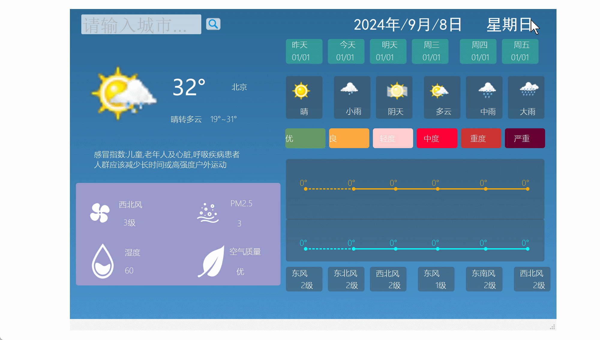

# QTdemo-weather

成品效果演示：

该项目基于c++ Qt实现的天气预报应用程序。该程序实现了自动显示本地城市近7天的天气情况，包括最高，低温度，风向，空气质量情况，天气晴阴情况等。
另外该程序还可以搜索并显示中国其他城市的天气情况。

用的天气API接口：
国家气象局天气接口API
"http://t.weather.itboy.net/api/weather/city/101010100"（此101010100为北京市的城市码，要查询其他城市天气自行切换其他城市码。）

用到定位API：
百度定位API
"https://api.map.baidu.com/location/ip?ak=你的AK&coor=bd09ll"（此处的AK在百度开发者平台注册获得）

博客地址：https://blog.csdn.net/m0_65143871/article/details/141690701